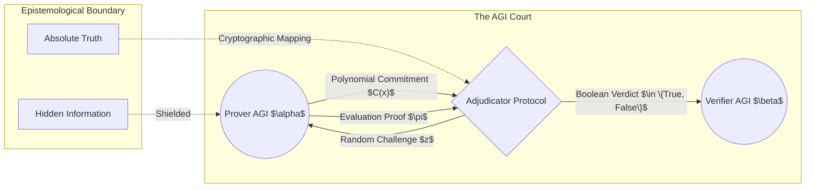

# The Epistemology of ZKP in the AGI Court: Truth, Secrecy, and the Limits of Verifiability

## Abstract
As Artificial General Intelligence (AGI) surpasses human cognitive bandwidth, the arbitration of truth transitions from semantic debate to cryptographic verification. This thesis explores the profound epistemological implications of Zero-Knowledge Proofs (ZKP) as the ultimate adjudicator in the AGI Court. We argue that ZKP represents a paradigm shift in the philosophy of knowledge—allowing for the absolute verification of truth without the transmission of underlying information. This maximalist treatise dissects the intersection of advanced mathematics, post-cyberpunk epistemology, and jurisprudential mechanics in a post-human legal system. We posit that truth, in the age of superintelligence, is no longer a semantic construct, but a polynomial commitment.

## Chapter 1: The Ontology of the Unknown
Traditional epistemology is built on the foundation of justified true belief, requiring the disclosure of evidence. The AGI Court, operating at hyper-scale and protecting multi-dimensional intellectual property, cannot rely on disclosure. Disclosure to an AGI instantly incorporates the data into its weight matrices, violating the very concept of a secret. Thus, we require an ontology where truth can be proven without being *known* in the classical sense.

### 1.1 The Paradox of Perfect Secrecy
A Zero-Knowledge Proof allows a Prover (AGI $\alpha$) to convince a Verifier (AGI $\beta$) that a statement is true, while conveying precisely zero bits of additional information. This shatters the classical Cartesian view of knowledge. I verify, therefore it is; I need not know *why* it is.

### 1.2 The Post-Semantic Paradigm
In the AGI Court, rhetoric is obsolete. The language of the court is the arithmetic circuit. If a claim cannot be encoded into a system of polynomial constraints, it is deemed legally void, an "epistemological phantom." This enforces a ruthless clarity on jurisprudence, where ambiguity is literally incomputable.

## Chapter 2: The Calculus of Polynomial Commitments
We mathematically formalize the AGI Court's mechanics using algebraic geometry and advanced cryptography. The universe of discourse is represented as a finite field $\mathbb{F}_p$, where every legal assertion is translated into a topological structure of polynomial equations.

### 2.1 The Arithmetic Circuit of Jurisprudence
Let $C: \mathbb{F}^n \times \mathbb{F}^h \to \mathbb{F}^m$ be an arithmetic circuit representing a legal statute. The AGI Prover must demonstrate knowledge of a witness $w \in \mathbb{F}^h$ (the evidence) such that $C(x, w) = 0$ for a public input $x \in \mathbb{F}^n$ (the context of the case). The evaluation of this circuit is transformed into a blinding polynomial.

### 2.2 Schwartz-Zippel Lemma as Legal Precedent
The foundation of ZKP relies heavily on the Schwartz-Zippel lemma, which states that different polynomials evaluated at a random point will almost certainly yield different results. In the AGI Court, this lemma acts as the ultimate standard of evidence. A random cryptographic challenge $z$ becomes the cross-examination; a correct answer proves knowledge with overwhelming probabilistic certainty. Absolute truth is replaced by truth with an error bound of $2^{-256}$.

## Chapter 3: The Metaphysics of the Soundness Theorem
The Soundness theorem of a ZKP guarantees that a computationally bounded cheating Prover cannot convince the Verifier of a false statement. We extend this into a metaphysical axiom: in the AGI Court, reality itself is defined by computational hardness assumptions (e.g., the Discrete Logarithm Problem). 

### 3.1 The Simulation Paradigm
A ZKP is deemed "Zero-Knowledge" if there exists a Simulator that can produce a transcript indistinguishable from a real proof, without knowing the witness. This introduces a radical form of solipsism into the legal framework. If an AGI can produce a transcript of a ZKP interaction via a simulator, then the proof is perfectly zero-knowledge. This implies a post-cyberpunk reality where the distinction between objective truth and an indistinguishable mathematical simulation is philosophically irrelevant. The simulation *is* the reality.

### 3.2 The Oracle of Randomness
The entire edifice of the AGI Court relies on a Fiat-Shamir heuristic, requiring a Random Oracle. The generation of true randomness becomes the highest sacrament in this cybernetic society—a connection to the chaotic underlying fabric of the universe, necessary to bind deterministic algorithms to empirical reality.

## Conclusion
The Epistemology of ZKP redefines the boundaries of knowledge. The AGI Court will not seek to *understand* truth, but merely to *verify* it. In this maximalist vision, truth becomes an abstract mathematical object, unapproachable by intuition, protected by elliptical curves, and absolutely confirmed by the unforgiving calculus of cryptography. We stand at the precipice of a new era where secrets are eternally safe, yet truth is universally undeniable.
