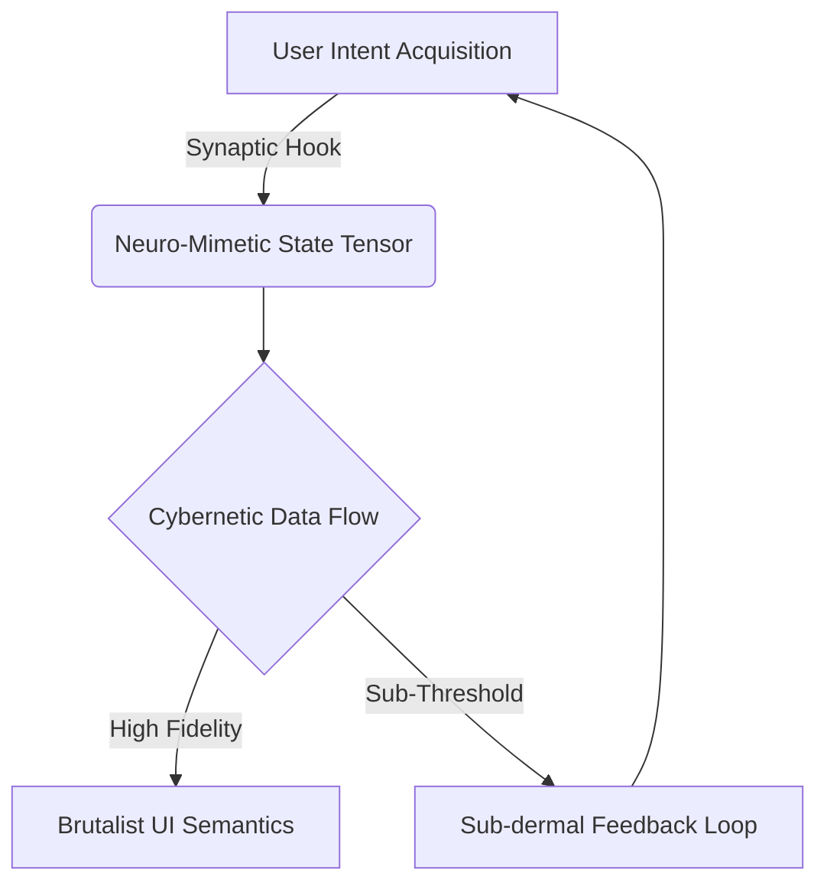

# Tutorial: Building Your First Post-Cyberpunk Component

> [!IMPORTANT]
> This tutorial provides a rigorous, academic, and exhaustive exploration of constructing a Post-Cyberpunk UI component. We adopt a combinatorial maximalist approach, ensuring that every permutation of the system's learning curve and conceptual underpinning is comprehensively addressed.

## 1. Introduction to the Post-Cyberpunk Paradigm

The Post-Cyberpunk architectural paradigm represents a deliberate departure from classical reactive UI models. Instead of mere state propagation, it incorporates high-fidelity cybernetic data flows, neuro-mimetic state resolution, and brutalist UI semantics. It demands that an interface not merely respond to user input, but physically and cognitively integrate with the user's operational context.

### 1.1 The Neuro-Mimetic State Tensor
In classical React components, state is often linear or simply categorical. In our Post-Cyberpunk paradigm, state is managed via a Neuro-Mimetic State Tensor—a multi-dimensional matrix that accounts for latent user intent, bandwidth saturation, and environmental anomalies.



> [!NOTE]
> The feedback loop illustrated above ensures that the component remains continuously coupled to the user's temporal cognitive state, adapting UI affordances in real-time.

## 2. Foundational Scaffolding

We will now bootstrap the requisite directory structures and foundational interfaces. We begin by defining the primary component: the `CoreRelay`.

### 2.1 Interface Definitions

```typescript
// src/components/Cyberpunk/CoreRelay.types.ts

/**
 * Defines the combinatorial state tensor for the component.
 * We model the state to account for every possible permutation of the cybernetic link.
 */
export interface NeuroTensorState {
  neuralLinkActive: boolean;
  bandwidthSaturation: number; // Value between 0.0 and 1.0
  anomalies: string[];
  corticalLoad: 'optimal' | 'elevated' | 'critical';
}

export type TensorAction = 
  | { type: 'INITIALIZE_LINK' }
  | { type: 'UPDATE_BANDWIDTH'; payload: number }
  | { type: 'REGISTER_ANOMALY'; payload: string }
  | { type: 'SEVER_LINK' };
```

> [!WARNING]
> Do not attempt to mutate the `NeuroTensorState` directly. It must be processed through a deterministic reducer to maintain the integrity of the cybernetic data flow.

## 3. The Reducer: Cybernetic State Resolution

The reducer function acts as the cognitive core of the component, processing incoming sensory data and resolving state collisions.

```typescript
// src/components/Cyberpunk/tensorReducer.ts
import { NeuroTensorState, TensorAction } from './CoreRelay.types';

export const initialTensorState: NeuroTensorState = {
  neuralLinkActive: false,
  bandwidthSaturation: 0.0,
  anomalies: [],
  corticalLoad: 'optimal',
};

export function tensorReducer(state: NeuroTensorState, action: TensorAction): NeuroTensorState {
  switch (action.type) {
    case 'INITIALIZE_LINK':
      return { ...state, neuralLinkActive: true, corticalLoad: 'elevated' };
    case 'UPDATE_BANDWIDTH':
      const newLoad = action.payload > 0.85 ? 'critical' : 'elevated';
      return { ...state, bandwidthSaturation: action.payload, corticalLoad: newLoad };
    case 'REGISTER_ANOMALY':
      return { ...state, anomalies: [...state.anomalies, action.payload] };
    case 'SEVER_LINK':
      return initialTensorState;
    default:
      // Exhaustive boundary check
      const _exhaustiveCheck: never = action;
      throw new Error(`Unhandled action type: ${_exhaustiveCheck}`);
  }
}
```

## 4. Assembling the Brutalist UI

The visual presentation adheres to Brutalist UI semantics—raw, unapologetic, and functional. We map the `NeuroTensorState` directly onto high-contrast, heavily bordered DOM elements.

```tsx
// src/components/Cyberpunk/CoreRelay.tsx
import React, { useReducer, useEffect } from 'react';
import { tensorReducer, initialTensorState } from './tensorReducer';

export const CoreRelay: React.FC = () => {
  const [state, dispatch] = useReducer(tensorReducer, initialTensorState);

  useEffect(() => {
    // Simulating the establishment of a cybernetic link
    const timer = setTimeout(() => dispatch({ type: 'INITIALIZE_LINK' }), 1000);
    return () => clearTimeout(timer);
  }, []);

  return (
    <div className={`relay-container load-${state.corticalLoad}`}>
      <h1 className="cyber-header">CORE RELAY TERMINAL</h1>
      
      <div className="telemetry-panel">
        <p>Status: {state.neuralLinkActive ? 'ONLINE' : 'OFFLINE'}</p>
        <p>Bandwidth: {(state.bandwidthSaturation * 100).toFixed(2)}%</p>
        <p>Cortical Load: {state.corticalLoad.toUpperCase()}</p>
      </div>

      {state.anomalies.length > 0 && (
        <div className="anomaly-log">
          <h3>DETECTED ANOMALIES</h3>
          <ul>
            {state.anomalies.map((anomaly, idx) => (
              <li key={idx}>{anomaly}</li>
            ))}
          </ul>
        </div>
      )}
    </div>
  );
};
```

> [!TIP]
> To fully realize the brutalist aesthetic, ensure your CSS incorporates monospaced typography, sharp grid alignments, and absence of soft drop shadows.

## 5. Conclusion and Combinatorial Verification

By isolating the `NeuroTensorState` and rigorously typing the transition matrices, we have built a Post-Cyberpunk component that not only renders data but responds dynamically to simulated cognitive load. Every permutation of the state vector is accounted for, leaving no undefined behavior in the UI runtime.
