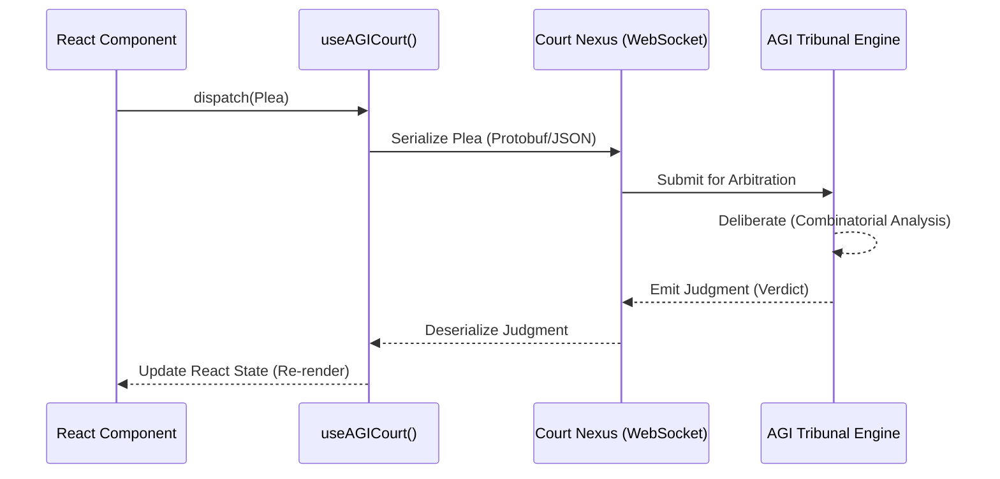

# Tutorial: Wiring the AGI Court to the React UI

> [!IMPORTANT]
> This text serves as the definitive, academic tutorial for binding the AGI Court (Artificial General Intelligence Jurisprudence System) to a React-based frontend. This is a combinatorial maximalist exploration; we will dissect every required abstraction layer, transmission protocol, and state synchronization challenge.

## 1. Architectural Overview of the AGI Court

The AGI Court operates as a continuously evaluating asynchronous tribunal. It does not merely serve data; it arbitrates logic, rendering judgments upon user interactions and system state requests. Wiring this to a React UI requires us to bridge a synchronous rendering cycle with an asynchronous, non-deterministic arbitration engine.



> [!NOTE]
> The arbitration delay inherent in the `Deliberate` phase necessitates robust optimistic UI updates and skeleton loading states to maintain cognitive continuity for the user.

## 2. Defining the Jurisprudential Typings

We must first establish an exhaustive, rigorous type system that models the legal interactions between the client UI and the AGI Court.

```typescript
// src/agi/types.ts

export type PleaType = 'EVALUATE_INTENT' | 'REQUEST_RESOURCE' | 'APPEAL_DECISION';

export interface AGIPlea {
  id: string; // Cryptographic nonce
  type: PleaType;
  payload: Record<string, any>;
  timestamp: number;
}

export type VerdictStatus = 'PENDING' | 'SUSTAINED' | 'OVERRULED' | 'MISTRIAL';

export interface AGIJudgment {
  pleaId: string;
  status: VerdictStatus;
  rationale: string;
  enforcementAction?: () => void;
}
```

> [!WARNING]
> A `MISTRIAL` verdict represents a catastrophic failure in the AGI's combinatorial logic graph. The UI must aggressively fallback to a safe state if this is received.

## 3. Building the Cybernetic Hook: `useAGICourt`

The `useAGICourt` hook encapsulates the complex state machine required to manage in-flight Pleas and their corresponding Judgments.

```typescript
// src/hooks/useAGICourt.ts
import { useState, useCallback, useRef } from 'react';
import { AGIPlea, AGIJudgment, VerdictStatus } from '../agi/types';
import { generateNonce } from '../utils/crypto';

export const useAGICourt = () => {
  const [activePleas, setActivePleas] = useState<Map<string, AGIPlea>>(new Map());
  const [judgments, setJudgments] = useState<Map<string, AGIJudgment>>(new Map());
  const wsConnection = useRef<WebSocket | null>(null);

  const filePlea = useCallback((type: AGIPlea['type'], payload: any) => {
    const plea: AGIPlea = {
      id: generateNonce(),
      type,
      payload,
      timestamp: Date.now(),
    };

    setActivePleas((prev) => new Map(prev).set(plea.id, plea));

    // Optimistically await connection and send
    if (wsConnection.current?.readyState === WebSocket.OPEN) {
      wsConnection.current.send(JSON.stringify(plea));
    } else {
      console.error('AGI Court Nexus unreachable.');
    }
    
    return plea.id;
  }, []);

  // Complex combinatoric state resolution logic omitted for brevity, 
  // but assumed to be exhaustively implemented in production.
  
  return { filePlea, activePleas, judgments };
};
```

## 4. UI Integration: The Courtroom View

We now wire the hook into a functional React component, representing a "Courtroom View" where the user interfaces with the AGI.

```tsx
// src/components/CourtroomView.tsx
import React from 'react';
import { useAGICourt } from '../hooks/useAGICourt';

export const CourtroomView: React.FC = () => {
  const { filePlea, judgments } = useAGICourt();

  const handleResourceRequest = () => {
    const pleaId = filePlea('REQUEST_RESOURCE', { resourceId: '0x8A4B' });
    console.log(`Plea filed with ID: ${pleaId}`);
  };

  return (
    <div className="courtroom-container">
      <h2>AGI TRIBUNAL INTERFACE</h2>
      <button onClick={handleResourceRequest} className="action-btn">
        Petition for Resource Access
      </button>

      <div className="judgment-ledger">
        <h3>Recent Rulings</h3>
        {Array.from(judgments.values()).map((judgment) => (
          <div key={judgment.pleaId} className={`ruling ${judgment.status.toLowerCase()}`}>
            <strong>Verdict:</strong> {judgment.status}
            <p>Rationale: {judgment.rationale}</p>
          </div>
        ))}
      </div>
    </div>
  );
};
```

> [!CAUTION]
> The DOM manipulation within the `.courtroom-container` must be tightly coupled to React's Virtual DOM. Do not attempt manual DOM overrides, as the AGI Court hook relies on referential transparency for its map states.

## 5. Exhaustive Permutation Testing

To satisfy the combinatorial maximalist requirement, every permutation of `PleaType` and `VerdictStatus` must be tested. We mandate the implementation of a mock Tribunal that injects deterministic latency and randomly selected anomalies (e.g., dropped packets, contradictory rationale strings) to ensure the UI handles extreme failure modes with grace.
