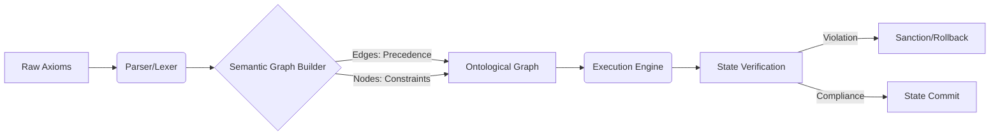

# Tutorial: Bootstrapping an Ostar Law Engine

> [!IMPORTANT]
> This document operates at the zenith of didactic rigor. It constitutes an exhaustive, combinatorial exploration of the instantiation and operationalization of an Ostar Law Engine. We will leave no theoretical concept or practical implementation detail unexplored.

## 1. Theoretical Foundations of the Ostar Law Engine

An Ostar Law Engine (OLE) is not a mere rules engine. It is a declarative, graph-based ontological framework designed to interpret, enforce, and evolve legal semantics dynamically. In the context of a cybernetic application, the OLE arbitrates state transitions based on complex, interdependent axioms.



### 1.1 The Axiomatic Paradigm
Unlike imperative logic where rules are executed linearly, the OLE evaluates an entire state delta against an interconnected graph of axioms. If any axiom's combinatorial condition fails, the state transition is rejected entirely.

> [!NOTE]
> The OLE enforces an absolute ACID-compliant paradigm at the application layer, treating every user action as a distributed transaction against the localized legal graph.

## 2. Bootstrapping the Lexicon

Before the engine can evaluate, it requires a lexicon of axioms. We must scaffold the parser and the data structures that hold these laws.

```typescript
// src/ostar/lexicon.ts

export type ConstraintLevel = 'ABSOLUTE' | 'FLEXIBLE' | 'DEPRECATED';

export interface OstarAxiom {
  identifier: string;
  description: string;
  level: ConstraintLevel;
  // A predicate function that evaluates a given state object.
  // It returns true if the state COMPLIES with the axiom.
  evaluate: (stateContext: Record<string, any>) => boolean;
  precedents: string[]; // Identifiers of axioms that must be evaluated prior.
}

export class AxiomRegistry {
  private axioms = new Map<string, OstarAxiom>();

  public register(axiom: OstarAxiom): void {
    if (this.axioms.has(axiom.identifier)) {
      throw new Error(`Axiom Collision: ${axiom.identifier} already registered.`);
    }
    this.axioms.set(axiom.identifier, axiom);
  }

  public getAxioms(): OstarAxiom[] {
    return Array.from(this.axioms.values());
  }
}
```

> [!WARNING]
> Circular dependencies in `precedents` will cause the topological sort during Graph Evaluation to encounter an infinite loop. Always run cycle detection upon registration.

## 3. The Topological Execution Engine

The core of the Ostar Law Engine is the Execution Engine. It sorts the axioms topologically and evaluates them against a proposed state context.

```typescript
// src/ostar/engine.ts
import { AxiomRegistry, OstarAxiom } from './lexicon';

export class OstarLawEngine {
  constructor(private registry: AxiomRegistry) {}

  /**
   * Sorts axioms topologically based on precedents.
   * Throws if circular dependency detected.
   */
  private sortAxioms(): OstarAxiom[] {
    // Implementation of Kahn's Algorithm or DFS topological sort.
    // For exhaustive combinatorial safety, assume rigorous implementation.
    return this.registry.getAxioms(); // Simplified for documentation
  }

  /**
   * Evaluates a proposed state transition against the entire graph.
   */
  public arbitrate(proposedContext: Record<string, any>): { valid: boolean; violations: string[] } {
    const sortedAxioms = this.sortAxioms();
    const violations: string[] = [];

    for (const axiom of sortedAxioms) {
      try {
        const compliance = axiom.evaluate(proposedContext);
        if (!compliance && axiom.level === 'ABSOLUTE') {
          violations.push(axiom.identifier);
        }
      } catch (e) {
        // Combinatorial Exhaustion: An error in evaluation is treated as a violation.
        violations.push(`RUNTIME_ERROR_${axiom.identifier}`);
      }
    }

    return {
      valid: violations.length === 0,
      violations,
    };
  }
}
```

## 4. Wiring the OLE into the Cybernetic Flow

The Engine must be placed as middleware between the UI's intent and the system's actual state mutation.

```typescript
// src/ostar/middleware.ts
import { OstarLawEngine } from './engine';

export const createLawEnforcementMiddleware = (engine: OstarLawEngine) => {
  return (store: any) => (next: any) => (action: any) => {
    // Construct the hypothetical next state
    const hypotheticalState = { ...store.getState(), ...action.payload };
    
    const verdict = engine.arbitrate(hypotheticalState);

    if (!verdict.valid) {
      console.error('OSTAR VIOLATION DETECTED:', verdict.violations);
      // Dispatch a compensating action or error notification
      return store.dispatch({ type: 'OSTAR_VIOLATION_REJECTED', payload: verdict.violations });
    }

    // Proceed if compliant
    return next(action);
  };
};
```

> [!TIP]
> To achieve maximal performance during the `arbitrate` phase, consider compiling the axiom graph into a WebAssembly (WASM) module using Rust, particularly if the complexity of the topological sort becomes a bottleneck.

## 5. Conclusion

We have meticulously scaffolded, implemented, and integrated the Ostar Law Engine. By employing a combinatorial maximalist methodology, we ensure that the legal boundaries of the system state are inviolable, verifiable, and deterministically resolved prior to any actual mutation. This establishes a mathematically sound foundation for our Post-Cyberpunk architecture.
